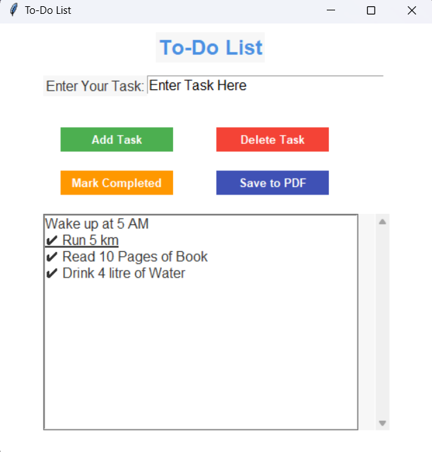

# ToDoList

This is a simple To-Do List application built with Python's Tkinter for GUI and reportlab for PDF generation. The app allows users to manage daily tasks efficiently and save them as a PDF file for reference.

<h2>Features:</h2> 
1 Add Tasks: Enter a task and add it to the list. 
2 Delete Tasks: Remove unwanted tasks from the list. 
3 Mark as Completed: Highlight tasks as completed by marking them with a ✔. 
4 Save to PDF: Export the current task list to a neatly formatted PDF file. 

